# Inventory Access Gateway
Token-based gateway that enables secure, authenticated access to the Inventory Service

## 1. High-Level System Design


### Key Components & Responsibilities

| Component | Responsibility |
|-----------|----------------|
| **AWS Cognito User Pool** | User authentication, JWT token issuance, user management |
| **AWS Cognito User Groups** | Role-based access through Cognito User Groups |
| **AWS AppSync** | GraphQL API endpoint, request routing, authentication validation |
| **GraphQL Resolvers** | Business logic execution, data transformation, DynamoDB integration |
| **Amazon DynamoDB** | Inventory data storage with high availability and auto-scaling |
| **IAM Roles** | Fine-grained access control and least-privilege enforcement |

### Sequence of Operations


## 2. Security Considerations

### Authentication Mechanism
- **JWT Tokens**: Industry-standard tokens with configurable expiration
- **Multi-Factor Authentication**: Optional for enhanced security

### Authorization & RBAC
- **User Groups**: Role-based access through Cognito User Groups, where each tenant is represented as a Cognito group
- **Backend Validation**: Python Flask application validates JWT tokens, verifies user group, and blocks unauthorized requests before reaching AppSync
- **AppSync Schema**: Fine-grained authorization using AppSync VTL resolvers, enforcing tenant-based data isolation by extracting user groups from Cognito JWT
- **DynamoDB**: DynamoDB uses `tenant` (partition key) and `id` (sort key) to enforce tenant boundaries at the database level, preventing cross-tenant data access

### Token Lifecycle Management
- **Expiration**: Configurable token TTL (default: 1 hour access, 30 days refresh)
- **Rotation**: Automatic refresh token rotation on usage
- **Revocation**: Immediate token invalidation through Cognito APIs

## 3. Infrastructure & DevOps Considerations

### Deployment Strategy
- **Serverless Architecture**: AWS managed services (Cognito, AppSync, DynamoDB) for zero server management
- **Application Deployment**: Application Deployment using Helm charts and ArgoCD to EKS
- **Infrastructure as Code**: Terraform modules for reproducible deployments
- **Multi-Environment**: Dev/Staging/Production environment separation

**Infrastructure Deployment flow**:

**Application Deployment Flow**:

```mermaid
flowchart LR
    subgraph "CI Pipeline"
        A[Code Commit] --> B[Build & Test]
        B --> C[Push Image<br/>Tag: commit-sha]
    end

    subgraph "Dev Environment"
        C --> D[Update GitOps Repo<br/>dev/values.yaml]
        D --> E[ArgoCD Auto-Sync]
        E --> F[Deploy to Dev]
    end

    subgraph "Staging Environment"
        F --> G[Promote Image Tag<br/>to staging/values.yaml]
        G --> H[ArgoCD Sync]
        H --> I[Deploy to Staging]
    end

    subgraph "Production"
        I --> J[Manual Approval]
        J --> K[Update prod/values.yaml]
        K --> L[ArgoCD Deploy to Prod]
    end

    style C fill:#90EE90
    style F fill:#87CEEB
    style I fill:#FFD700
    style L fill:#FF6B6B
```



### Observability Stack
- **Metrics**: CloudWatch custom metrics for API performance and usage
- **Logging**: Collect and centralize application\appsync\cognito logs for monitoring and troubleshooting
- **Alerting**: Automated alerts for error rates, latency, and security events

## 4. Scalability & Extensibility

### Multi-Tenant Support
- **Tenant Isolation**: After a user signs up, a tenant identifier is sent to a Post Confirmation Lambda, which automatically assigns the user to the appropriate Cognito group. This ensures each user is linked to the correct tenant, enabling the application to enforce tenant-specific access and maintain strict data isolation across organizations

### Scalability
- **Auto-Scaling**: Usage of managed services for out of the box scaling
- **Multi-Environment Deployment**: Supports deployment across multiple environments and regions
- **HPA**: Dynamically adjusts the number of pods based on CPU and memory usage

## 5. Technology Choices

### Core Technologies
| Technology | Justification |
|------------|---------------|
| **AWS AppSync** | Managed GraphQL service that simplifies data access and integrates seamlessly with Cognito and DynamoDB for secure, scalable APIs. |
| **AWS Cognito** | Provides managed authentication and authorization with JWT support, user groups, and federated identity integration. |
| **Amazon DynamoDB** | Serverless NoSQL database offering high availability, auto-scaling, and predictable performance for multi-tenant data storage. |
| **Terraform** | Infrastructure as Code (IaC) tool ensuring consistent, version-controlled AWS resource provisioning. |
| **Python Flask application** | Lightweight backend responsible for authenticating users, validating JWTs, and securely forwarding GraphQL queries to AppSync. |
| **EKS** | Running the backend application |
| **Helm** | Managing kubernetes components lifecycle |

### Testing the implemenation
Under test-api folder we can run the ```query.sh``` script. 

This simulates querying the service backend. 
The script requires two parameters:
we will pass 2 parameters
1) The domain name of the backend service
2) Valid JWT from cognito login

```
➜  ./query.sh <backend-domain.com> <valild JWT>
➜ {"appsync_response":{"data":{"getItems":[{"data":"{\"some\":\"value\"}","id":"1","tenant":"example-client-tenant-dev"}]}}}
```

If we will pass random JWT or the user that associated with the JWT is not part of an alllowed group to query appsync we will get
```
➜ {"error":"Invalid or expired token"}
```
